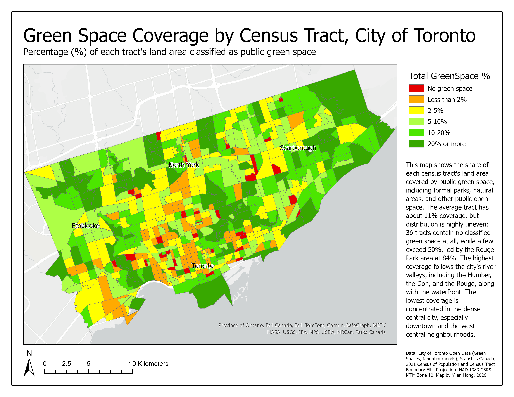
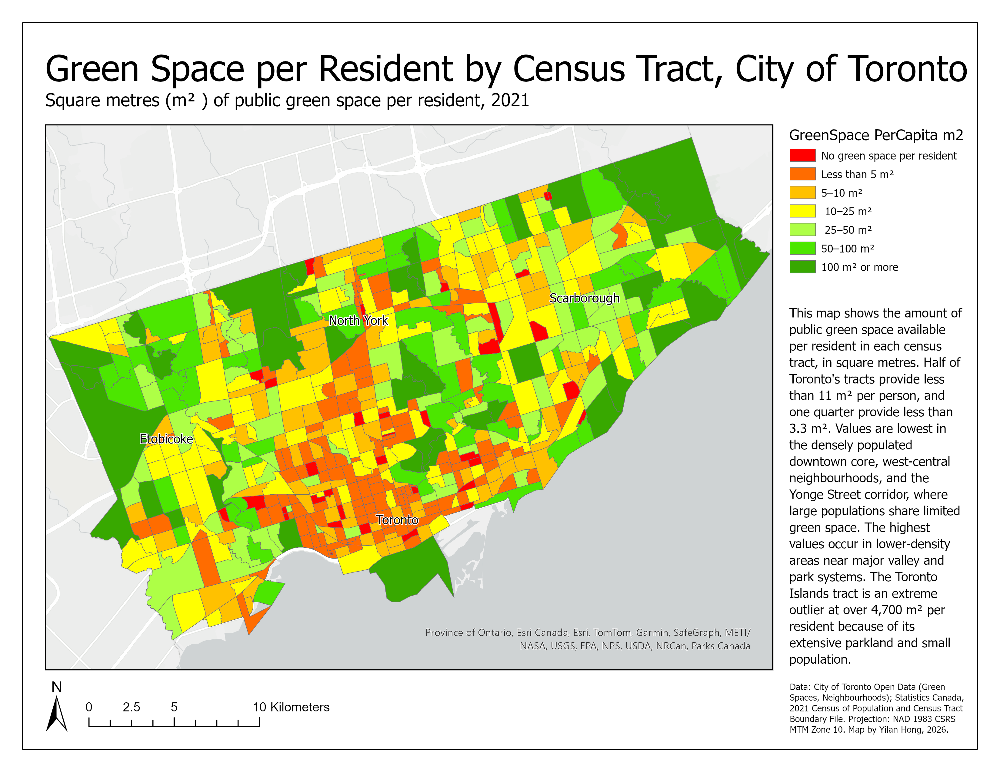
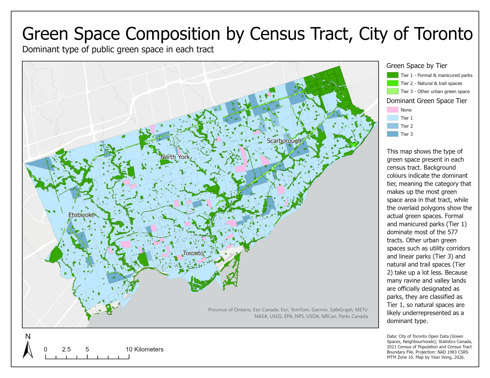
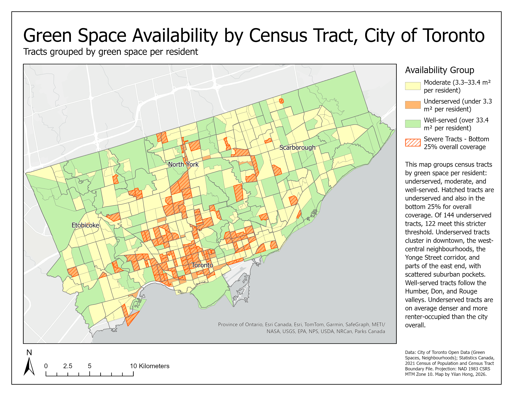
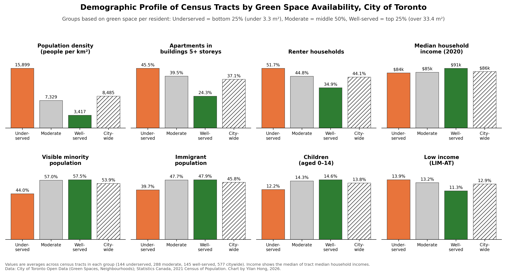
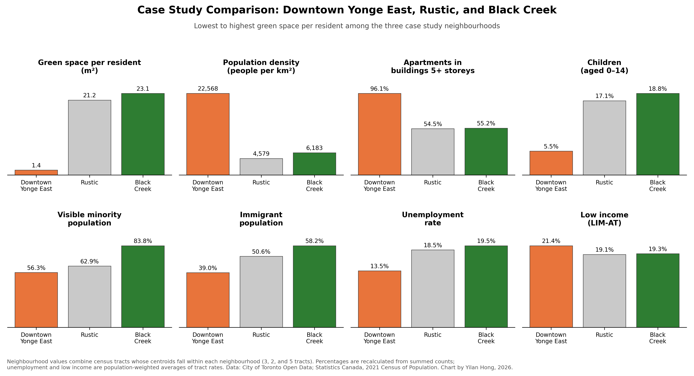

# Mapping Green Space Availability Across Toronto's Census Tracts

**How is public green space distributed across the City of Toronto, what kinds of green space make up each area, and how do the demographics of well-served and underserved areas compare?**

This project classifies Toronto's public green spaces into a three-tier typology, measures green space availability for 577 census tracts, identifies underserved and well-served areas, and then profiles their demographic characteristics using 2021 Census data. Demographics were deliberately kept out of the availability measures so that the spatial pattern could be identified first and interpreted second.

**Tools:** ArcGIS Pro · Python (pandas, matplotlib) · SQL attribute queries · PowerShell
**Data:** City of Toronto Open Data · Statistics Canada 2021 Census of Population

---

## Key Maps

| Green space coverage | Green space per resident |
|---|---|
|  |  |

| Green space composition | Availability groups and case study areas |
|---|---|
|  |  |

Full-resolution PDF versions are in the [`maps/`](maps/) folder.

---

## Key Findings

- **Green space is unevenly distributed.** The average tract has 11.1% green space coverage, but 36 tracts (6.2%) contain no classified public green space, while the Rouge Park area reaches 84%. Half of all tracts provide less than 11 m² of green space per resident.
- **Underserved areas are concentrated in the dense central city.** Tracts in the bottom 25% for green space per resident (under 3.3 m²) cluster downtown, in the west-central neighbourhoods, along the Yonge Street corridor, and in parts of the east end. Well-served tracts follow the Humber, Don, and Rouge river valleys.
- **Most underserved areas lack green space outright, not only relative to population.** 122 of 144 underserved tracts (85%) are also in the bottom 25% for total coverage.
- **Urban form is the strongest pattern.** Underserved tracts average nearly twice the city's population density (15,899 vs. 8,485 people per km²), with more high-rise apartments (45.5% vs. 37.1%) and renter households (51.7% vs. 44.1%).
- **The demographic pattern is not the one commonly assumed.** Underserved tracts have *lower* visible minority (44.0% vs. 53.9%) and immigrant (39.7% vs. 45.8%) shares than the city average, and near-average incomes. Well-served tracts are wealthier (median household income $91,000 vs. $86,000). Many of Toronto's most racialized and immigrant inner-suburban communities score as moderate or well-served, largely due to ravines, river valleys, and utility corridors.
- **Formal parks dominate.** Tier 1 parks are the largest green space type in 495 of 577 tracts; utility corridors and other urban green space (Tier 3) dominate 41 tracts.



### Case Study Comparison

Three neighbourhoods were compared to illustrate the range of conditions:

| | Downtown Yonge East | Rustic | Black Creek |
|---|---|---|---|
| Green space per resident | 1.4 m² | 21.2 m² | 23.1 m² |
| Population density | 22,568 /km² | 4,579 /km² | 6,183 /km² |
| Apartments 5+ storeys | 96.1% | 54.5% | 55.2% |
| Visible minority population | 56.3% | 62.9% | 83.8% |
| Unemployment rate | 13.5% | 18.5% | 19.5% |

Black Creek has roughly 16 times more green space per resident than Downtown Yonge East, while facing higher unemployment and having the highest visible minority share of the three. This illustrates that high green space *availability* does not necessarily coincide with socioeconomic advantage, and raises questions about green space quality and usability that area-based measures cannot capture.



---

## Methods Overview

1. **Green space classification.** Classified 3,379 green space polygons into Tier 1 (formal and manicured parks, 1,929), Tier 2 (natural heritage and trail spaces, 233), Tier 3 (other public and urban green space, 258), and Excluded (cemeteries, golf courses, roads, private or paid-entry sites, 959) using priority-ordered SQL attribute queries. Every record was assigned to exactly one category, verified by reconciling counts against the source total.
2. **Census data processing.** Filtered the 2.6 GB Statistics Canada Census Profile file to Toronto CMA census tracts and 15 selected variables using Python, then reshaped it from long to wide format.
3. **Study area definition.** Joined census data to tract boundaries and selected the 577 tracts whose centroids fall within the City of Toronto, keeping tracts whole so census values remain valid.
4. **Spatial overlay.** Intersected green space with census tracts and summarized green space area by tract and tier.
5. **Availability measures.** Calculated green space coverage (% of tract land area), green space per resident (m²), tier composition, and the dominant tier for each tract.
6. **Classification and comparison.** Grouped tracts into quartile-based availability groups using green space per resident, flagged the most severely underserved tracts, and compared group demographic profiles against the citywide average.

See [`docs/methodology.md`](docs/methodology.md) for the full workflow, key decisions, and validation steps.

---

## Limitations

This project measures green space **availability** (how much green space exists within each tract), not **accessibility** (how easily residents can reach it). Residents often use parks in neighbouring tracts, and the analysis does not account for walking distance, park entrances, barriers, or green space quality. Demographic comparisons are descriptive and do not establish causation. See [`docs/limitations.md`](docs/limitations.md) for a full discussion.

---

## Repository Structure

```
├── README.md
├── maps/                    Map layouts (PNG and PDF)
├── charts/                  Comparison charts
├── data/
│   ├── summary_tables/      Group and case study result tables
│   └── DATA_SOURCES.md      Data sources, licences, and attribution
├── queries/
│   └── tier_classification.sql
├── scripts/                 Census processing and chart scripts
└── docs/
    ├── methodology.md
    └── limitations.md
```

---

## Data Sources

Contains information licensed under the Open Government Licence – Toronto. Adapted from Statistics Canada, 2021 Census of Population. This does not constitute an endorsement by Statistics Canada of this product. See [`data/DATA_SOURCES.md`](data/DATA_SOURCES.md) for details.

---

**Yilan Hong** · Geospatial Data Science and Environmental Management, University of Toronto Mississauga
[LinkedIn](www.linkedin.com/in/yilan-hong-4b10002b1) · [Email](yilan.hong2005@gmail.com)
